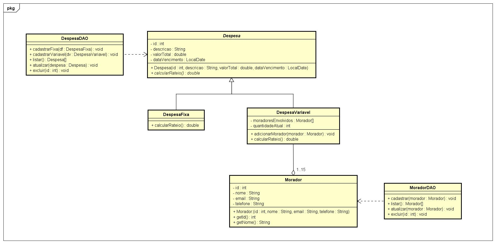
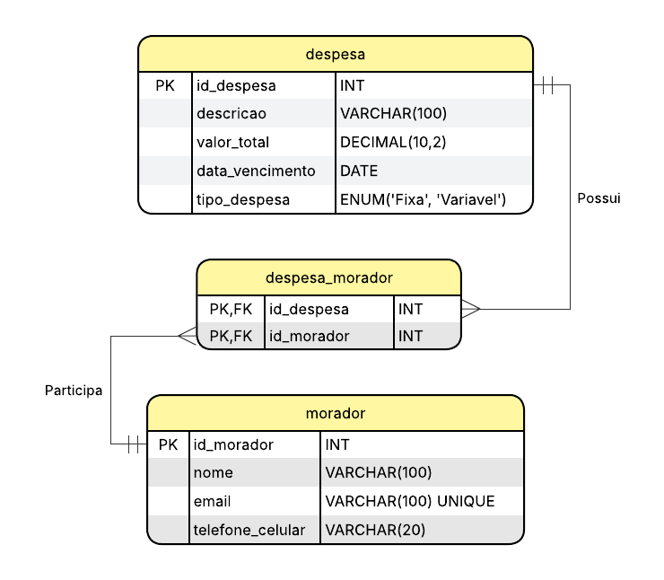

# SplitShare - Conciliador Financeiro para Moradias Compartilhadas

Este repositório contém o projeto desenvolvido para a Atividade de Estudo Programada (AEP) do curso de Engenharia de Software.

**Integrantes:** Gabriela Marotti dos Santos, Lorena de Oliveira Dias e Maria Eduarda de Oliveira Carvalho  
**Tema ODS 11:** Cidades e Comunidades Sustentáveis

## 📌 Lista de Requisitos Funcionais

| ID | Descrição do Requisito |
| :--- | :--- |
| **RF01** | O sistema deve permitir o gerenciamento (cadastro, edição e exclusão) de moradores, contendo apenas nome, e-mail e telefone celular. |
| **RF02** | O sistema deve permitir o cadastro de "Despesas Fixas" (ex: Aluguel), informando descrição, valor total e data de vencimento, dividindo o valor automaticamente entre todos os moradores cadastrados. |
| **RF03** | O sistema deve permitir o cadastro de "Despesas Variáveis" (ex: Mercado), permitindo vincular especificamente quais moradores (relação 1:N) farão parte daquela divisão. |
| **RF04** | O sistema deve permitir a listagem (leitura) de todas as despesas cadastradas no banco de dados, exibindo o valor total e o valor da fração calculada. |
| **RF05** | O sistema deve permitir a edição e a exclusão de despesas cadastradas, para caso o morador tenha lançado algum valor ou data de forma incorreta. |

## 📅 Cronograma de Execução

| Data Prevista | Atividade (Etapa de Desenvolvimento) | Responsável |
| :---: | :--- | :---: |
| 4° semana/ago | Levantamento de Requisitos, Definição do Escopo e Alinhamento ODS | Gabriela, Lorena e Maria Eduarda |
| 4° semana/ago | Criação do Repositório GitHub, Estruturação de Pastas (/src, /docs, /database) e arquivo README.md | Lorena |
| 1° semana/set | Elaboração dos Diagramas (Diagrama de Classes e Diagrama do Banco de Dados - DER) | Maria Eduarda |
| 1° semana/set | Redação Final do Documento em PDF (Justificativa Técnica e Arquitetural) | Gabriela |
| **11/09/2026** | **Submissão da 1ª Entrega (Concepção e Arquitetura)** | **Equipe Completa** |
| 4° semana/set | Criação dos Scripts SQL (DDL) no MySQL e Estruturação do Banco | Gabriela |
| 1° semana/out | Implementação das Classes Java (Aplicando Herança e Polimorfismo) | Lorena |
| 1° semana/out | Desenvolvimento do CRUD e Conexão da Aplicação com o Banco de Dados | Maria Eduarda |
| 3° semana/out | Testes de Integração, Correção de Bugs e Commit Final no GitHub | Gabriela, Lorena e Maria Eduarda |
| **30/11/2026** | **Submissão da 2ª Entrega (Software Funcional e Integrado)** | **Equipe Completa** |

## 📊 Diagrama de Classes

## 🗄️ Diagrama de Banco de Dados (DER)

